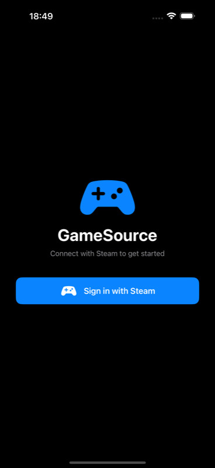
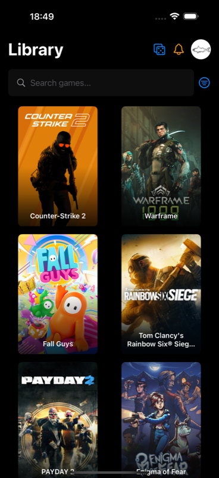
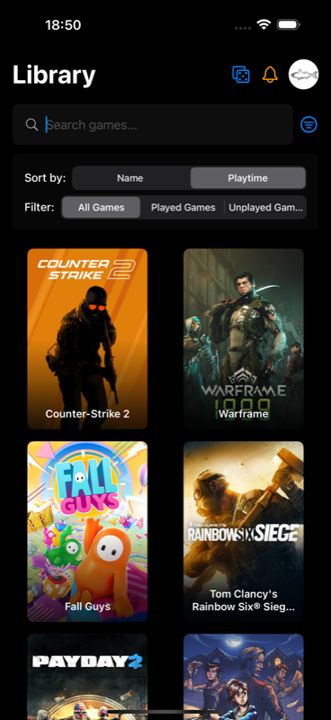
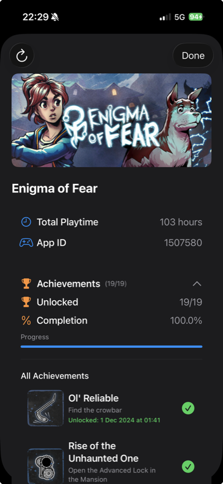
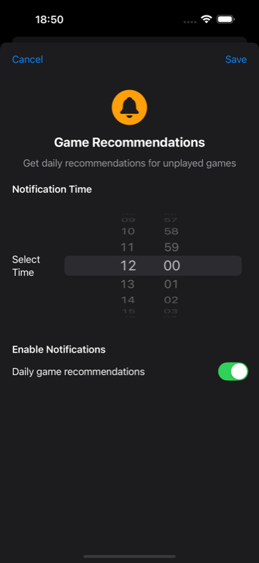

<div align="center">


# GameSource

### Your Steam library and achievements, beautifully in your pocket. 🎮

Sign in with Steam, browse your whole game library, search and filter it, and dive
into every game's stats and achievements — in a clean, native SwiftUI app.

<br/>

[](https://www.apple.com/ios/)
[](https://swift.org)
[](https://developer.apple.com/xcode/swiftui/)
[](https://steamcommunity.com/dev)
[](LICENSE)

<br/>

<a href="https://apps.apple.com/br/app/gamesource/id6749157683">
  
</a>
&nbsp;
<a href="https://www.linkedin.com/posts/enzoferroni_gostaria-de-compartilhar-com-voc%C3%AAs-um-projeto-ugcPost-7358562327186620417-LI9j/">
  
</a>

</div>

---

## 📑 Table of Contents

- [About](#-about)
- [Screenshots](#-screenshots)
- [Features](#-features)
- [How It Works](#-how-it-works)
- [Tech Stack](#-tech-stack)
- [Project Structure](#-project-structure)
- [Getting Started](#-getting-started)
- [Author](#-author)
- [License](#-license)

---

## ✨ About

**GameSource** is a native **SwiftUI** iOS app that connects to your **Steam**
account through Steam OpenID, then brings your entire game library to life: cover
art, playtime, completion progress, and the full achievement list for every title —
all fetched live from the **Steam Web API**.

No passwords are ever handled by the app — authentication happens entirely on
Steam's own login page.

---

## 📱 Screenshots

<div align="center">

| Steam Sign-In | Library | Filters & Sorting |
|:---:|:---:|:---:|
|  |  |  |

| Game Details & Achievements | Notifications |
|:---:|:---:|
|  |  |

</div>

---

## 🚀 Features

- 🔐 **Sign in with Steam** — secure OpenID login, no credentials touch the app
- 📚 **Full game library** — cover art, playtime and quick browsing
- 🔎 **Search & filter** — find games by name and sort/filter your collection
- 🏆 **Achievements** — per-game progress, completion %, and unlock dates
- 🎯 **Game recommendations** — personalized suggestions from your library
- 🔔 **Notifications** — configurable notification settings
- 🌙 **Native dark UI** — polished SwiftUI interface, light & dark icon variants

---

## 🧠 How It Works

GameSource authenticates with **Steam OpenID** and reads data from the **Steam Web API**:

1. The user taps **Sign in with Steam** and is sent to Steam's official login page.
2. After login, Steam redirects to a small `index.html` callback page hosted on
   GitHub Pages, which forwards the result back into the app via a custom URL
   scheme (`loginsteam://callback`).
3. `AuthViewModel` extracts the resolved **SteamID** from the callback.
4. `SteamService` calls the Steam Web API to load the owned games, playtime,
   profile and per-game achievements; `GamesViewModel` handles search & filtering.

```
SteamLoginButton ──▶ Steam OpenID ──▶ index.html ──▶ loginsteam://callback
        │                                                     │
        ▼                                                     ▼
   AuthViewModel  ◀──────────  SteamID  ──────────▶  SteamService ──▶ Steam Web API
```

---

## 🛠️ Tech Stack

- **Language:** Swift 5
- **UI:** SwiftUI
- **Networking:** `URLSession` against the Steam Web API
- **Auth:** Steam OpenID + custom URL scheme callback
- **Architecture:** MVVM (Models · Services · ViewModels · Views)
- **Minimum target:** iOS 15.6

---

## 📂 Project Structure

```
GameSource/GameSource/
├── GameSourceApp.swift            # App entry point
├── Models/                        # Codable types mapping Steam API responses
│   ├── SteamGame.swift
│   ├── SteamAchievement.swift
│   ├── SteamUserProfile.swift
│   └── FilterOptions.swift
├── Services/
│   ├── SteamService.swift         # Steam Web API calls
│   ├── APIConfiguration.swift     # Reads the API key from APIKeys.plist
│   └── GameRecommendationService.swift
├── ViewModels/
│   ├── AuthViewModel.swift        # Steam OpenID login flow
│   └── GamesViewModel.swift       # Library, search & filters
└── Views/                         # SwiftUI screens & components
    ├── LoginView.swift / SteamLoginButton.swift
    ├── AuthenticatedView.swift / ContentView.swift
    ├── GameGridView.swift / GameCardView.swift
    ├── GameDetailView.swift / AchievementRowView.swift
    ├── FilterBarView.swift / NotificationSettingsView.swift
    └── EmptyStateView.swift / LoadingStateView.swift / SteamImageView.swift
```

---

## 🎯 Getting Started

**Requirements:** Xcode 15+ and a [Steam Web API key](https://steamcommunity.com/dev/apikey).

```bash
# 1. Clone the repository
git clone https://github.com/EnzoFerroni/GameSource
cd GameSource

# 2. Create your keys file from the template
cp GameSource/GameSource/APIKeys.plist.template GameSource/GameSource/APIKeys.plist
```

3. Open `APIKeys.plist` and replace `YOUR_STEAM_API_KEY_HERE` with your Steam Web API key.
   > `APIKeys.plist` is in `.gitignore` — your key is never committed.

```bash
# 4. Open the project in Xcode
open GameSource/GameSource.xcodeproj
```

5. Pick a simulator or device and run with **⌘R**.

---

## 👤 Author

<div align="center">
  <table>
    <tr>
      <td align="center" width="100%">
        <a href="https://github.com/EnzoFerroni"></a>
        <br/><sub><b>Enzo Ferroni</b></sub><br/><br/>
        <a href="https://github.com/EnzoFerroni"></a>
        <a href="https://www.linkedin.com/in/enzoferroni/"></a>
      </td>
    </tr>
  </table>
</div>

---

## 📄 License

Released under the [MIT License](LICENSE). © 2025 Enzo Ferroni.

<div align="center">
<br/>
<sub>Not affiliated with Valve or Steam. Built with 💙 and SwiftUI.</sub>
</div>
